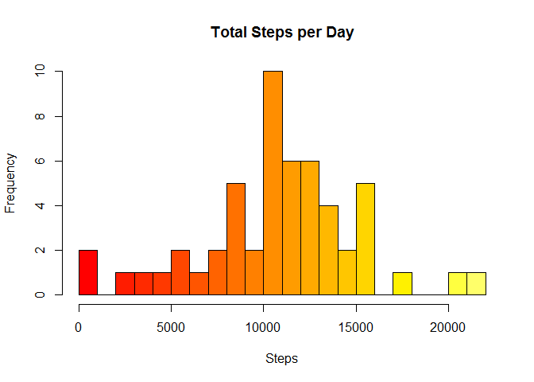
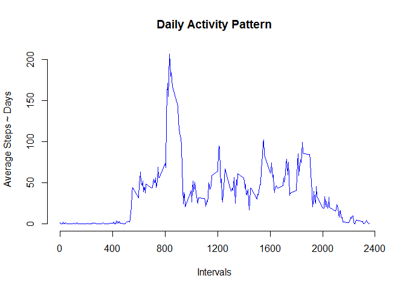
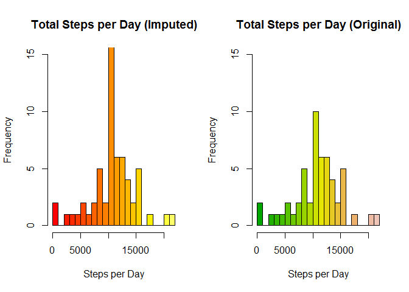
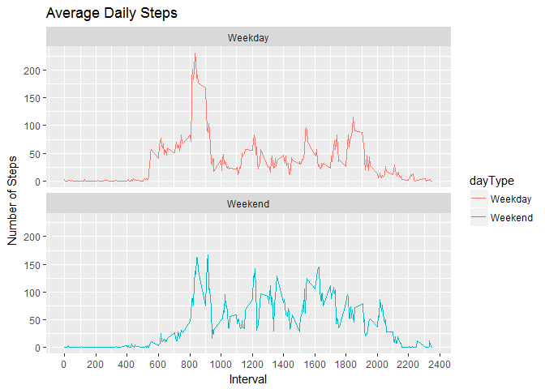

# Reproducible Research: Peer Assessment 1


## Loading and preprocessing the data

###The data is contained locally in activity.zip Unzip the file and load the containing file activity.csv.


```r
  zfile <- "activity.zip"
  csvfile <- "activity.csv"
	if(file.exists(zfile))
	  unzip(zipfile = zfile)
	if(file.exists(csvfile))
	  activityData <- read.csv(csvfile)
  activityData$date<- as.Date(activityData$date)  ##covert chr to date
```

## What is mean total number of steps taken per day?

###Calculate the total number of steps taken per day


```r
sumTable <- aggregate(activityData$steps ~ activityData$date, FUN=sum, )
colnames(sumTable)<- c("Date", "Steps")
mean_steps <- as.integer(mean(sumTable$Steps))
median_steps <- as.integer(median(sumTable$Steps))
```

###Plot a histogram of the total number of steps taken each day, and calculate the mean and median. 


```r
hist(sumTable$Steps, breaks=25, xlab="Steps", main = "Total Steps per Day", col = heat.colors(25))
```

<!-- -->

The daily mean for steps per day is 10766.

The daily median for steps per day is 10765.

## What is the average daily activity pattern?

###Calculate the five minute average and plot a line chart.  Calculate the maximum interval.


```r
intervalMeans <- aggregate(steps ~ interval, data = activityData, FUN = mean, na.rm = TRUE)

plot(x = intervalMeans$interval, 
    y = intervalMeans$steps, 
    type = "l", 
    col = "blue",
    xlab = "Intervals",
    ylab = "Average Steps ~ Days",
    main = "Daily Activity Pattern",
    axes=F)
axis(2)
axis(1, seq(0,2400, b=400))
```

<!-- -->

```r
maxInterval <- intervalMeans$interval[which.max(intervalMeans$steps)]
```

The maximum interval is 835.

## Imputing missing values

###Count the number of missing values. 


```r
impute <- sum(is.na(activityData$steps))
```

The number of missing values is 2304.

###Replace the NA values with the mean results for five minute intervals.  Display a histogram for the original data and for the new data with the NA's replaced with the interval means.  Calculate the mean and median for the new imputed intervals.


```r
activityData2 <- activityData
nas <- is.na(activityData2$steps)
avg_interval <- tapply(activityData2$steps, activityData2$interval, mean, na.rm=TRUE, simplify = TRUE)
activityData2$steps[nas] <- avg_interval[as.character(activityData2$interval[nas])]

intervals2 <- aggregate(steps ~ date, data = activityData2, FUN = sum)

intervals1 <- aggregate(steps ~ date, data = activityData, FUN=sum, na.rm = TRUE )

par(mfcol = c(1,2))
hist(intervals2$steps, 
    main = "Total Steps per Day (Imputed)", 
    xlab = "Steps per Day", 
    col = heat.colors(25),
    ylim = c(0,15),
    breaks=25)

hist(intervals1$steps, 
    main = "Total Steps per Day (Original)", 
    xlab = "Steps per Day", 
    col = terrain.colors(25),
    ylim = c(0,15),
    breaks=25)
```

<!-- -->

```r
mean2 <- as.integer(mean(intervals2$steps))
median2 <- as.integer(median(intervals2$steps))
```

The mean of the imputed intervals is 10766.

The median of the imputed intervals is 10766.

## Are there differences in activity patterns between weekdays and weekends?

###Add a new column the contains the dayType as weekday or weekend.  Plot the activity for weekdays and weekend days to compare activity for the 2 day types.


```r
activityData2<- activityData2%>%
        mutate(dayType= ifelse(weekdays(activityData2$date)=="Saturday" | weekdays(activityData2$date)=="Sunday", "Weekend", "Weekday"))

Interval2<- activityData2%>%
        group_by(interval, dayType)%>%
        summarise(avg_steps2 = mean(steps, na.rm=TRUE))

plot<- ggplot(Interval2, aes(x =interval , y=avg_steps2, color=dayType)) +
       geom_line() +
       labs(title = "Average Daily Steps", x = "Interval", y = "Number of Steps") +
  scale_x_continuous(breaks=c(seq(0,2400, b=200))) +
       facet_wrap(~dayType, ncol = 1, nrow=2)
print(plot)
```

<!-- -->
